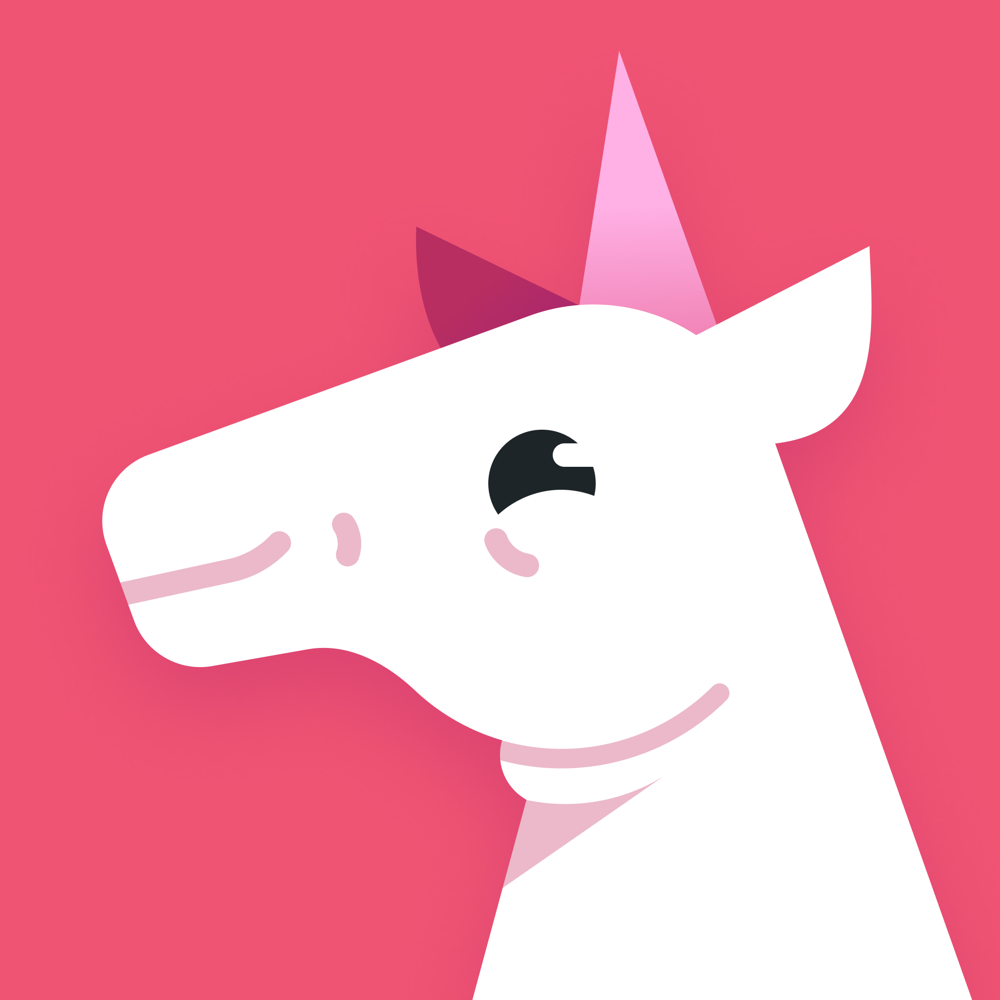
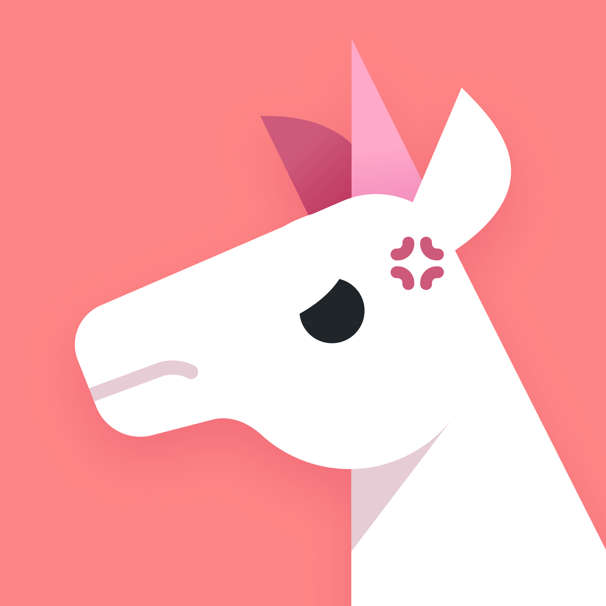
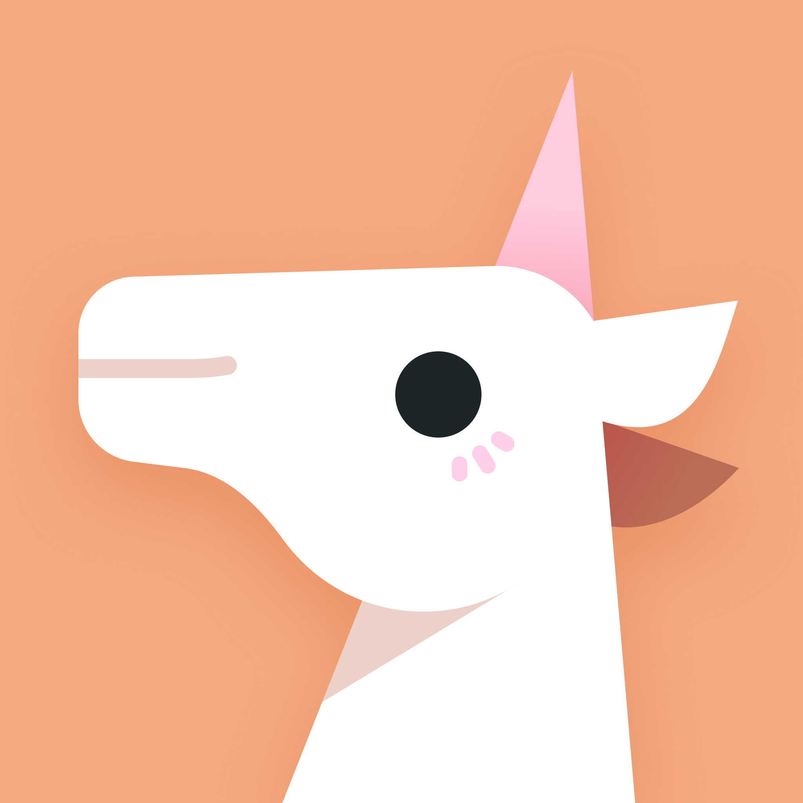
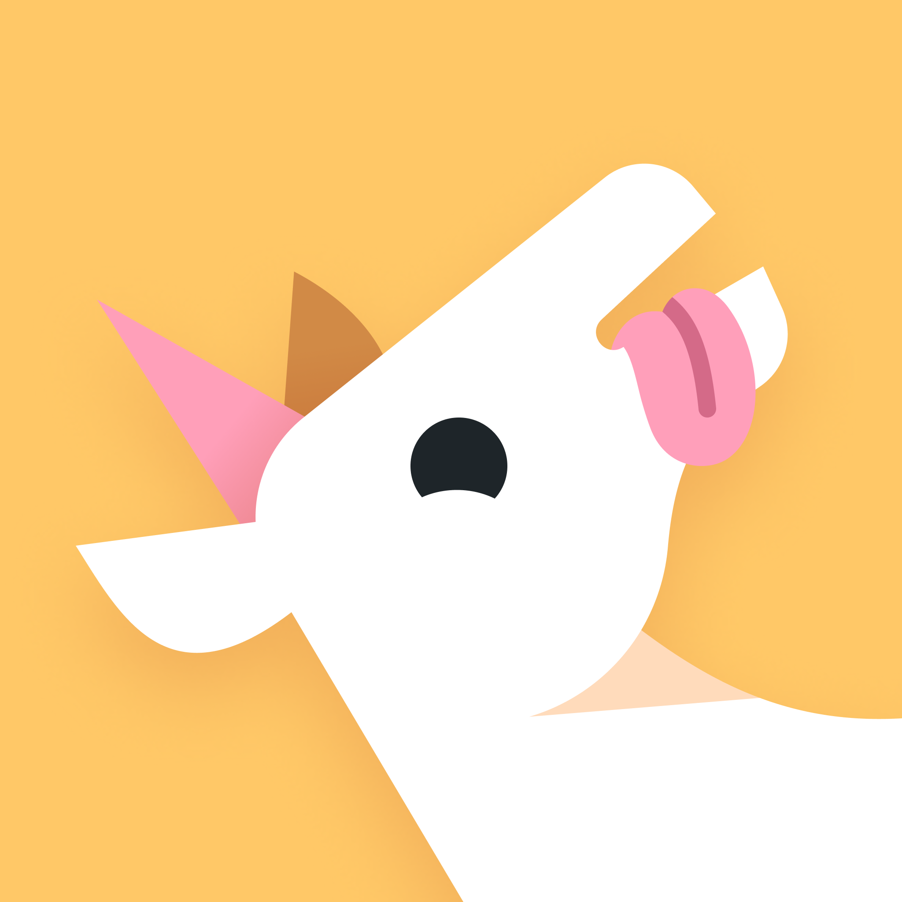
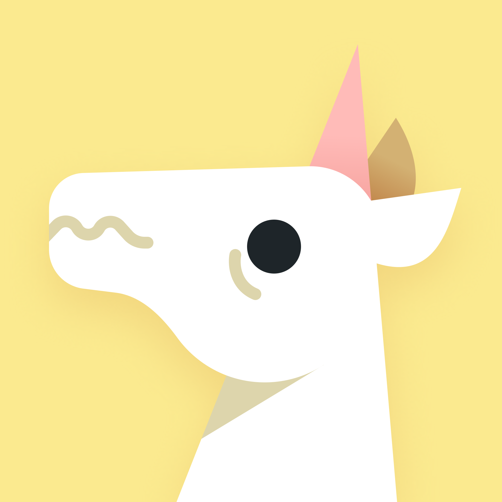
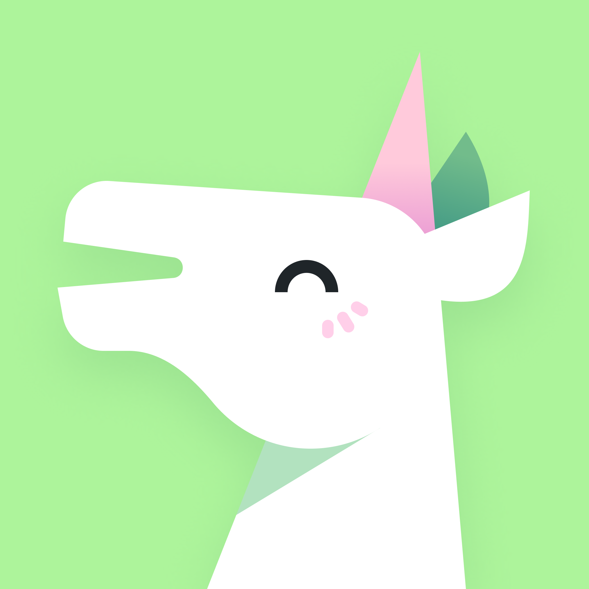
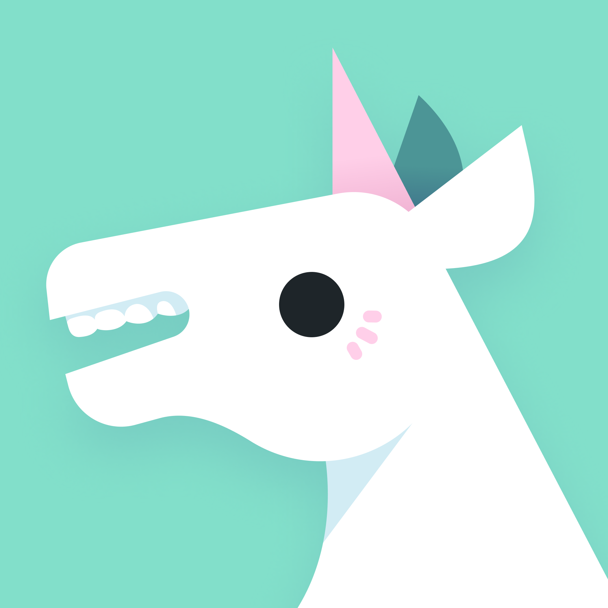
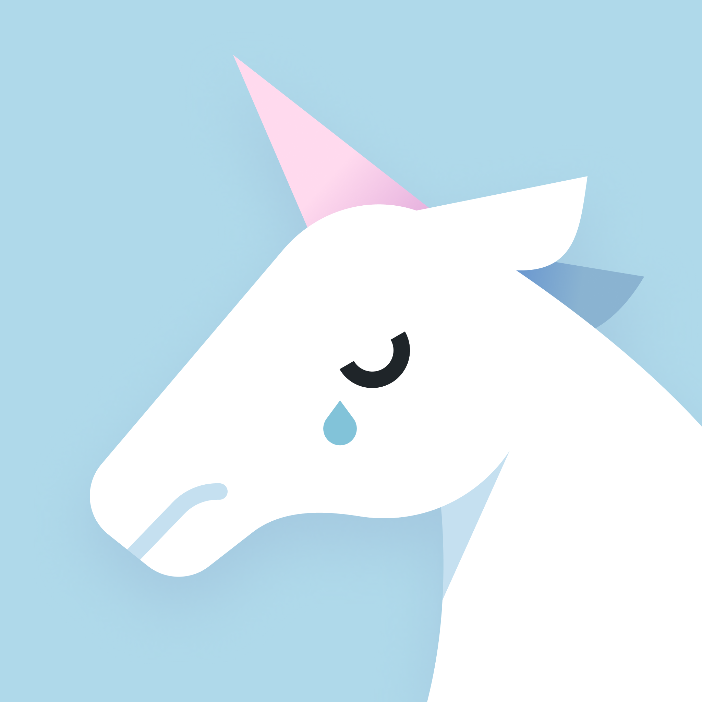
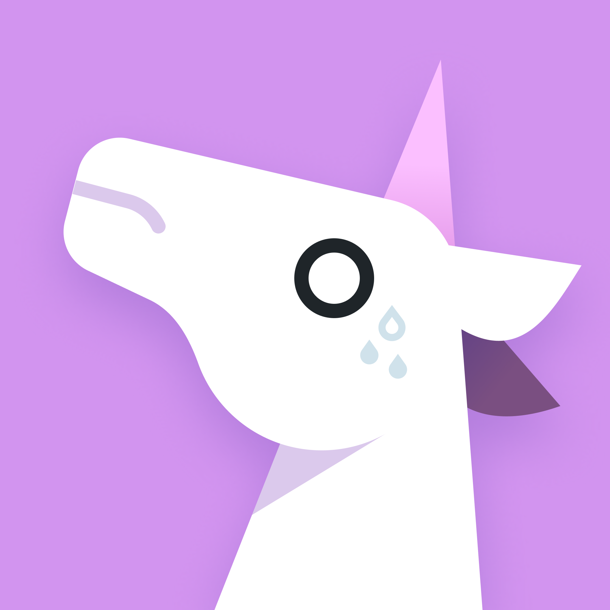

These are the official emotes for Unicorn Utterances

         

While this folder contains the SVG versions of the emotes, if you're looking for a pre-rendered version (to use as a profile picture for your UU profile, perhaps), you'll want to look [in `rendered` for PNG variants](./rendered)

They're covered under [the CC by NC ND license](https://creativecommons.org/licenses/by-nc-nd/4.0/)

